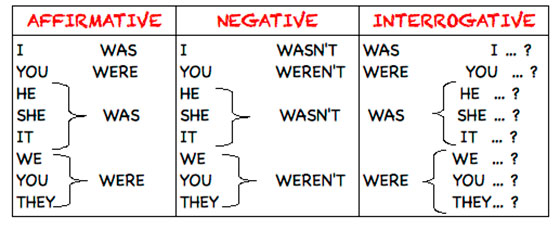

[dictionnaire FR-AN](https://www.wordreference.com/)

## Pour exprimer la préférence
* I would (I'd) rather + BV

> I'd rather travel to Spain than go to school !

* I would prefer + to + BV ( + than +  BV ou nom )

> I'd prefer to speak with friend than with the teacher.

 
 
 
 
 
=== "Question"

    traduit moi la phrase en utilisant les 2 options :
    
    _je préfère voyager avec quelqu'un._

=== "Réponse"

    
    * _I'd rather travel with someone. _
    
    * _I'd prefer ^^to^^  travel with someone._

 
 
 
 
 
 
 
 
 
 
 
 

 
 
 

## Le présent simple
* On utilise le présent simple pour **parler de ses habitudes, de ses goûts, de ce que l'on veut, de ce que l'on sait, ce que l'on pense, de ce que l'on espère**.
=== "Anglais"
    * > Students never **get bored**!
    * > I **eat** breakfast every morning.

=== "Français"
    * > Les élèves ne **s'ennuient** jamais !
    * > Je **mange (prend)** le petit-déjeuner tous les matins.

* À la forme affirmative, il faut ajouter un **-s** au verbe à la 3^e^ personne du singulier.
=== "Anglais"
    * > The sun **rises** in the morning.

=== "Français"
    * > Le soleil **se lève** le matin.

!!! Warning "Attention!"

    Quand le verbe se termine par **_-o, -s, -x, -sh, -ch,_** on ajoute -es et pas seulement **-s**.  
    Quand le verbe se termine par une consonne suivie d'un **_-y_**, on remplace le **_-y_** par un _-i_ et on ajoute **_es_**.
    === "Aller"
        * > go → goes

    === "Regarder"
        * > watch → watches
    
    === "essayer"
        * > try → tr^^i^^es

    === "Se dépêcher"
        * > hurry → hurr^^i^^es

 
 
 
 

* Aux formes **interrogative et negative**, il faut ajouter l'auxiliaire **do**, ou **does** à la 3^e^ personne du singulier.

=== "Anglais"
    * > **_Does_** she **_work_** here?
    * > He **_doesn't_** **_speak_** Spanish.

=== "Français"
    * > **Est**-ce qu'elle **travaille** ici ?
    * > Il **ne parle pas** espagnol.
 
 
 
 
 
 
 
 
 
 
 
 

 
 
 

## prétérit simple
* On utilise le présent simple pour **parler du passé**.

**Forme affirmative :**
=== "Anglais"
    * > I **wanted** to explore the world.
    * > I **worked** on my project.

=== "Français"
    * > Je **voulais** explorer le monde.
    * > J' **ai travaillé** sur mon projet.

!!! Warning "Attention!"

    Quand le verbe se termine par **-e, on ajoute seulement -d** : realize -> realise**d** 
    Quand le verbe se termine par une consonne suivie d'un **-y, on rajoute le -y par un -i et on ajoute -ed :** try -> tried
    On n'ajoute pas -ed aux verbes irréguliers. Il faut apprendre chaque verbe irrégulier par coeur. ([#verbes-irréguliers]([http://](https://pinkara.github.io/docs/)/Anglais/CoursAngl/#verbes-irréguliers))
    
    === "visiter"
        * > visit → visited
    
    === "essayer"
        * > try → tr^^i^^ed

    === "Se dépêcher"
        * > hurry → hurr^^i^^ed

!!! Warning "Attention!"

    Le préterit du modal **can** est **could**. Il se conjugue comme **can,** sans auxiliaire :

=== "anglais"
    * > I **couldn't** join the meeting yesterday.

=== "français"
    * > Je **ne pouvais pas** participer à la réunion hier.

**Forme négative et interrogative :**

Aux formes négative et interrogative, on ajoute l'auxiliaire **did** accompagné de la **BV** (base verbale).

**Le verbe be** :

 
 
 
 
 
 
 
 
 
 
 
 

 
 
 

## prétérit continu

**Le prétérit continu** ou **préterit en be + V-ing** permet de **décrire une scène, d'en préciser les circonstances ou de commenter un fait**, mais cette fois au **passé.**

