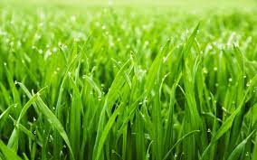

???+ warning

     Cette liste de vocabulaire changera

=== "English"

    spinach

=== "日本語"

    ホウレンソウ (1)
    { .annotate }

    1. 　菠薐草、法蓮草、赤根草

=== "Deutsch"

    Der Echte Spinat

=== "Français"

    épinard (1)
    { .annotate }

    1.  <b>déf</b> : Plante potagère (chénopodiacée) aux feuilles épaisses et molles d'un vert soutenu.{ align=left }

 

=== "English"

    a broom

=== "日本語"

    箒 (1)
    { .annotate }

    1. 　ほうき

=== "Deutsch"

    Ein Besen

=== "Français"

    un balai (1)
    { .annotate }

    1.  <b>déf</b> : Un balai est un  outil de nettoyage des sols composé d'une brosse, d'un faisceau de branchettes ou bien de fibres naturelles ou synthétiques. Y est souvent fixé un long manche permettant à l'utilisateur de s'en servir debout.{ align=left }

 

=== "English"

    the grass

=== "日本語"

    草 (1)
    { .annotate }

    1. 　くさ 
     
     
    

=== "Deutsch"

    Das Gras

=== "Français"

    L'herbe 

 

=== "English"

    foreground

=== "日本語"

    前景 (1)
    { .annotate }

    1. 　ぜんけい

=== "Deutsch"

    Vordergrund

=== "Français"

    premier plan 

 

=== "English"

    advertising

=== "日本語"

    広告 (1)
    { .annotate }

    1. こうこく

=== "Deutsch"

    Werbung

=== "Français"

    publicité

 

=== "English"

    commercial

=== "日本語"

    コマーシャル

=== "Deutsch"

    (_die_) Reklame

=== "Français"

    annonce publicitaire

 

=== "English"

    a class

=== "日本語"

    クラス

=== "Deutsch"

    Eine Klasse

=== "Français"

    un cours

 

=== "English"

    a curriculum

=== "日本語"

    カリキュラム

=== "Deutsch"

    ein Lehrplan

=== "Français"

    un programme scolaire

 

=== "English"

    a field trip

=== "日本語"

    遠足 (1)
    { .annotate }

    1. えんそく

=== "Deutsch"

    eine Exkursion

=== "Français"

    une sortie scolaire

 

=== "English"

    a high school

=== "日本語"

    高校 (1)
    { .annotate }

    1. こうこう

=== "Deutsch"

    eine Hochschule

=== "Français"

    un lycée

 

=== "English"

    a trail

=== "日本語"

    トレイル

=== "Deutsch"

    ein Weg

=== "Français"

    un sentier

 

=== "English"

    dig

=== "日本語"
    
    掘る (1)
    { .annotate }

    1. ほ‐る

=== "Deutsch"

    graben

=== "Français"

    creuser

 

=== "English"

    disturb

=== "日本語"
    
    乱す (1)
    { .annotate }

    1. みだ‐す

=== "Deutsch"

    stören

=== "Français"

    déranger
 
   
=== "English"

    dump into

=== "日本語"
    
    にダンプする

=== "Deutsch"

    reinwerfen

=== "Français"

    jeter dans
 

=== "English"

    rainforest

=== "日本語"
    
    雨林 (1)
    { .annotate }

    1. うりん

=== "Deutsch"

    Regenwald

=== "Français"

    forêt tropicale
 

=== "English"

    wipes

=== "日本語"
    
    ワイプ

=== "Deutsch"

    Tücher

=== "Français"

    lingettes
 

=== "English"

    painkiller

=== "日本語"
    
    鎮痛剤 (1)
    { .annotate }

    1. ちんつうざい

=== "Deutsch"

    Schmerzmittel

=== "Français"

    anti douleur
 

=== "English"

    plaster

=== "日本語"
    
    石膏 (1)
    { .annotate }

    1. せっこう

=== "Deutsch"

    Gips

=== "Français"

    plâtre
 

=== "English"

    disinfectant

=== "日本語"
    
    消毒剤 (1)
    { .annotate }

    1. しょうどくざい

=== "Deutsch"

    Desinfektionsmittel

=== "Français"

    désinfectant
 

=== "English"

    band-aid

=== "日本語"
    
    絆創膏 (1)
    { .annotate }

    1. ばんそうこう

=== "Deutsch"

    Ein Wundschnellverband, _oder_ Pflaster

=== "Français"

    pansement
 

=== "English"

    needle

=== "日本語"
    
    針 (1)
    { .annotate }

    1. はり

=== "Deutsch"

    (_die_) Nadel

=== "Français"

    aiguille
 

=== "English"

    thread

=== "日本語"
    
    糸 (1)
    { .annotate }

    1. いと

=== "Deutsch"

    (_der_) Faden

=== "Français"

    fil
 

=== "English"

    a bandage

=== "日本語"
    
    包帯 (1)
    { .annotate }

    1. ほうたい

=== "Deutsch"

    ein Verband

=== "Français"

    un bandage
 

=== "English"

    caving

=== "日本語"
    
    洞窟探検 (1)
    { .annotate }

    1. どうくつたんけん

=== "Deutsch"

    Höhlenforschung

=== "Français"

    spéléologie
 

