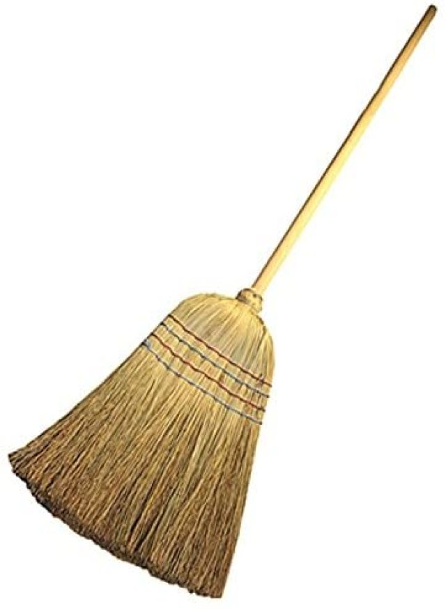
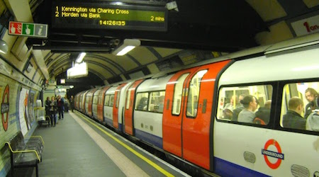

# Voca 

## SCHOOLS OF THE WILD

=== "Français"

    épinard

=== "Anglais"

    spinach (1)
    { .annotate }

    1.  
   

=== "Français"

    un balais

=== "Anglais"

    a broom (1)
    { .annotate }

    1.  
 
=== "Français"

    premier plan

=== "Anglais"

    foreground
 
=== "Français"

    publicité

=== "Anglais"

    advertising

 

=== "Français"

    publicité (vidéo)

=== "Anglais"

    commercial

 

=== "Français"

    un cours

=== "Anglais"

    a class

 

=== "Français"

    un programme scolaire

=== "Anglais"

    a curriculum

 

=== "Français"

    une sortie scolaire 

=== "Anglais"

    a field trip

 

=== "Français"

    un lycée

=== "Anglais"

    a high school

 

=== "Français"

    un sentier de randonnée

=== "Anglais"

    a trail

 

=== "Français"

    dig

=== "Anglais"

    creuser

 

=== "Français"

    déranger

=== "Anglais"

    disturb

 

=== "Français"

    pjeter (dans)

=== "Anglais"

    dump (into)

 

=== "Français"

    forêt tropicale

=== "Anglais"

    rainforest

 

=== "Français"

    attier attention

=== "Anglais"

    to draw attention

 

=== "Français"

    valoir le coup

=== "Anglais"

    to be worth it

 

=== "Français"

    se comporter, bien se tenir

=== "Anglais"

    behave

 

=== "Français"

    recettes

=== "Anglais"

    recipes

 

=== "Français"

    ratisser

=== "Anglais"

    rake up

 

=== "Français"

    au lieu de 

=== "Anglais"

    instead of

 

=== "Français"

    ramasser, rassembler, cueillir

=== "Anglais"

    to collect

 

=== "Français"

    patrimoine

=== "Anglais"

    heritage

 

=== "Français"

    héritage

=== "Anglais"

    inheritance

 

=== "Français"

    présenter

=== "Anglais"

    to feature

 

=== "Français"

    valider

=== "Anglais"

    to tick boxes

 

=== "Français"

    in case

=== "Anglais"

    au cas où

 

=== "Français"

    le comportement

=== "Anglais"

    behaviour

 

=== "Français"

    élements

=== "Anglais"

    components

 

=== "Français"

    surmonter, faire face, se débrouiller 

=== "Anglais"

    to cope

 

=== "Français"

    durer

=== "Anglais"

    to last

## TEENS CROSSING BORDERS

=== "Français"

    s'installer

=== "Anglais"

    settle somewhere

 

=== "Français"

    un réfugié

=== "Anglais"

    a refugee

 

=== "Français"

    un voyage organisé

=== "Anglais"

    a tour

 

=== "Français"

    un voyageur

=== "Anglais"

    a traveller

 

=== "Français"

    le métro

=== "Anglais"

    underground 
    (US) : subway 
    (UK-London) : the Tube (1)
    { .annotate }

    1.  

 

=== "Français"

    à l'étranger

=== "Anglais"

    abroad

 

=== "Français"

    à l'étranger (au delà des mers)

=== "Anglais"

    overseas

 

=== "Français"

     gagner de l'argent  (grâce au travail)

=== "Anglais"

    to earn money

 

=== "Français"

    gagner de l'argent (grâce à la lotterie)

=== "Anglais"

    to win money

 

=== "Français"

    petits boulots

=== "Anglais"

    casual jobs / odd jobs

 

=== "Français"

    très bien / clairement

=== "Anglais"

    clearly

 

=== "Français"

    les conséquences du décalage horaire

=== "Anglais"

    jet lag

 

=== "Français"

    affranchir

=== "Anglais"

    stamped

 

=== "Français"

    tamponner / oblitérer

=== "Anglais"

    to stamp

 

=== "Français"

    faire un pas en arrière

=== "Anglais"

    step backwards

 

=== "Français"

    faire un pas en avant

=== "Anglais"

    step forwards

 

=== "Français"

    avoir sommeil

=== "Anglais"

    to feel sleepy

 

=== "Français"

    fixer du regard

=== "Anglais"

    to stare at

 

=== "Français"

    qui fixe du regard

=== "Anglais"

    staring

 

=== "Français"

    trébucher

=== "Anglais"

    to stumble

 

=== "Français"

    passer la douane

=== "Anglais"

    to go through Customs

 

=== "Français"

    se rappeller

=== "Anglais"

    to recall

 

=== "Français"

    rester

=== "Anglais"

    to remain / to stay

 

=== "Français"

    faire du stop

=== "Anglais"

    hitchhiking

 