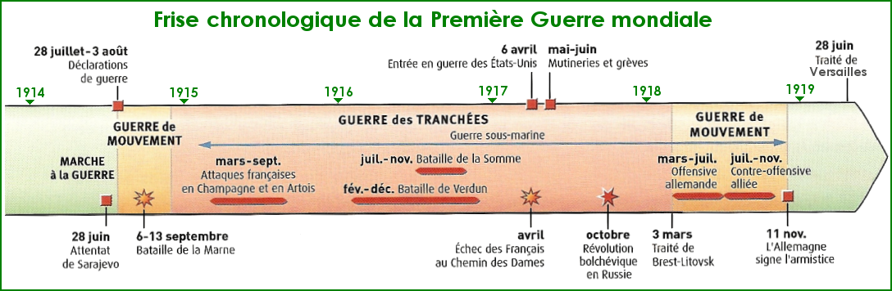
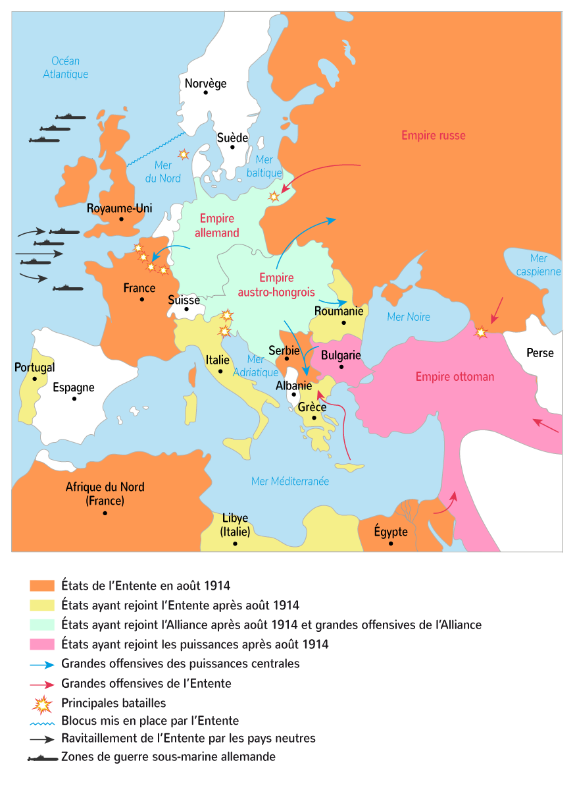

# L'europe, un theâtre majeur des guerres totales (1914-1945) 

## ^^Chapitre 1^^ : Civils et militaires dans la première guerre mondiale

Séance 1 - La  Première Guerre mondiale : Un conflit aux causes multiples qui s'inscrit dans la durée

Voir :

Act 1 (1)
{ .annotate }

1. <iframe width="560" height="315" src="https://www.youtube.com/embed/Tsy8k99rdiA?si=tRBL3MzFFwMA0EsX" title="YouTube video player" frameborder="0" allow="accelerometer; autoplay; clipboard-write; encrypted-media; gyroscope; picture-in-picture; web-share" allowfullscreen></iframe>

Act 2 (1) 
{ .annotate }

1.  

## ^^L'effort du guerre à l'arrière^^

### ^^Problématique^^ : Comment les civils sont-ils mobilisés pour l'effort de guerre ?

