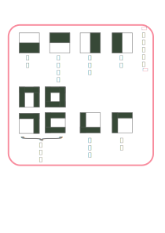

## 1　漢字の部首・筆順・画数

漢字を形で分類するときの目印となる部分を^^部首^^といいます。

# 【筆順・画数】

^^筆順^^は、漢字を書くときに、筆の運びが滑らかで、字の形も整えやすいという点から定まってきた線や点を書く順序です。

==上から下へ、左から右へ、外側の囲みは先に、== など、筆順の原則を身につけると、バランスのよい字が書けます。

漢字を書くときに、==一続きに線や点== を^^画^^ (^^点画^^) といい、==一つの漢字に使われている画の総数を^^画数^^ (^^総画数^^)といいます。

漢字の部首や読み方がわからないときは、漢字辞典の総画索引を使って引きます。

## 2　熟語の構成にはどんな種類があるの ？

## 3　言葉の意味と使い分け

## 4　同じ読みの言葉

## 5　慣用句とは　？

## 6　ことわざ・故事成語とは　？

## 7　敬語にはどんな種類があるの　？

