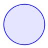
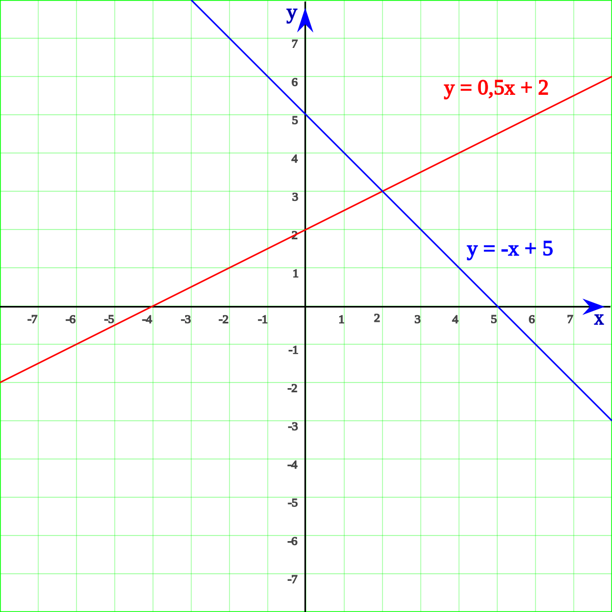

## Aires (formule)
- Carré : $A=c^2$  
  

- Rectangle : $A=L\times l$

- Triangle : $A=\frac{b\times h}{2}$

- Losange : $A=\frac{D \times d}{2}$

- Trapèze : $A=\frac{B+b}{2} \times h$
  

- Polygone régulier : $A=\frac{P}{2}\times a$

??? note annotate "l'apothème (1)"

    $a=\frac{c}{2\tan(\frac{180}{n})}$      

    n= nombre de côté

    On peut également exprimer la longueur "a" de l'apothème d'un poligone régulier de n côtés en fonction de la mesure du rayon du cercle circonscrit au polygone : $a={r\cos(\frac{180}{n})}$ 

1.  

- Cercle : $A=\pi r^2$
 
 
$P=2\pi r$

- Cône (aire latérale) : $A=\pi r \times g$

- Sphère : $A= 4\pi r^2$

##Volume et surface (formule)

la surface d'un solide est l'aire du patron de celui-ci

- Cube :  
$V=c^3$ 
  $S=6c^2$

- Parallélépipède :  
$V=L\times l \times h$  
$S=(2 \times L \times l)+(2 \times L \times h)+(2 \times l \times h)$

- prisme régulier :  
$V=Ab \times h$  
Ab = Aire de la base  

- cylindre : 
$V=\pi r^2 \times h$  
$S=2\pi r^2 + 2\pi r \times h$

- Cône (ou pyramide) :    le sommet des (pyramides/cônes) sont appellés "apex".  
   
$V= \frac{1}{3} Ab \times h$  
 
Ab = aire de la base

??? info "Pourquoi c'est $\frac{1}{3} Ab \times h$"

    Volume du cône  

     
     
    $\triangle ABM ~ \triangle AON$ (triangles similaires) 
     
    **Si on dit que x = AB, h = AO, k = BM et r = ON :**  
     
    $\frac{x}{h}=\frac{k}{r}$  
      $k=\frac{rx}{h}$  
      **Le Volume du Cône = Somme des Volumes de toutes les plaques**  
      
    $$\begin{align}
    {\int dv} & = \int_{0}^{h} \pi k^2 dx \\[2ex]
    {v} & = \pi \int_{0}^{h} (\frac{rx}{h})^2 dx \\[2ex]
    {v} & = \pi \frac{r^2}{h^2} \int_{0}^{h} x^2 dx \\[2ex]    
    {v} & = \frac{\pi r^2}{h^2} \times \frac{1}{3} \left( h^3-0 \right) \\[2ex]
    {v} & = \frac{1}{3} \pi r^2 h
    \end{align}$$

- sphère :  
$V=\frac{4}{3}\pi r^3$ 
 
??? info "Pourquoi c'est $\frac{4}{3}\pi r^3$"

     
     
    La méthode d'Archimède (redécouverte dans le palimpseste portant son nom) consiste à **découper la boule en disques minces**, donc des cylindres, dont on ajoute le volume (assimilé au produit de leur surface par leur épaisseur). En langage moderne, cela revient à **calculer la limite d'une somme de Riemann, et donc à calculer une intégrale définie. **Si l'on considère la variable h allant de **–R** à **R**, **le cylindre correspondant à la hauteur h et d'épaisseur infinitésimale dh a pour rayon rh vérifiant**, d'après le théorème de Pythagore rh2 + h2 = R2 ; comme le volume de ce cylindre est π rh2 dh, on obtient comme volume de la boule : 
     

  
    $$\begin{align}
    {V} & = \int_{-r}^{r} \pi(r^2-h^2) \mathrm{d}h \\[2ex]
    & = \left[ \pi(hr^2-\tfrac{1}{3}h^3) \right]_{-r}^{r} \\[2ex]
    & = \pi \left(r^3-\tfrac{1}{3}r^3 \right) - \pi \left(-r^3-\tfrac{1}{3}r^3 \right) \\[2ex]
    & = \tfrac{2}{3} \pi r^3 + \tfrac{2}{3} \pi r^3 \\[2ex]
    {V} & = \tfrac{4}{3} \pi r^3
    \end{align}$$

## fonctions et équations

**définition :**
  Une fonction est un procédé qui permet d'associer à un élément d'un ensemble de départ, un élément unique d'un ensemble d'arrivée. **Voici quelques exemples :** 
 

 

- $f(x)=0.5x+2$
 

- $f(x)=-x+5$
 
 
  
 

Il y a plusieurs fonction en maths : 
 
 
  - fonction exponentielle 
  - fonction logarithmique 
  - fonctions périodiques 
  - fonctions trigonométriques 
  etc... 

_**Fontion affine**_

une fonction affine est une fonction obtenue par addition et multiplication de la variable par des constantes. Elle peut donc s'écrire sous la forme : 
 
$f(x)=ax+b$ 
 
a = le coefficient directeur 
b= l'ordonnée à l'origine
 

_**fonction linéaire**_

Une fonction linéaire est une fonction qui à tout nombre x associe le nombre ax, où a est un nombre fixé. On note : 
 
$f(x)=ax$ 
 

  

    
