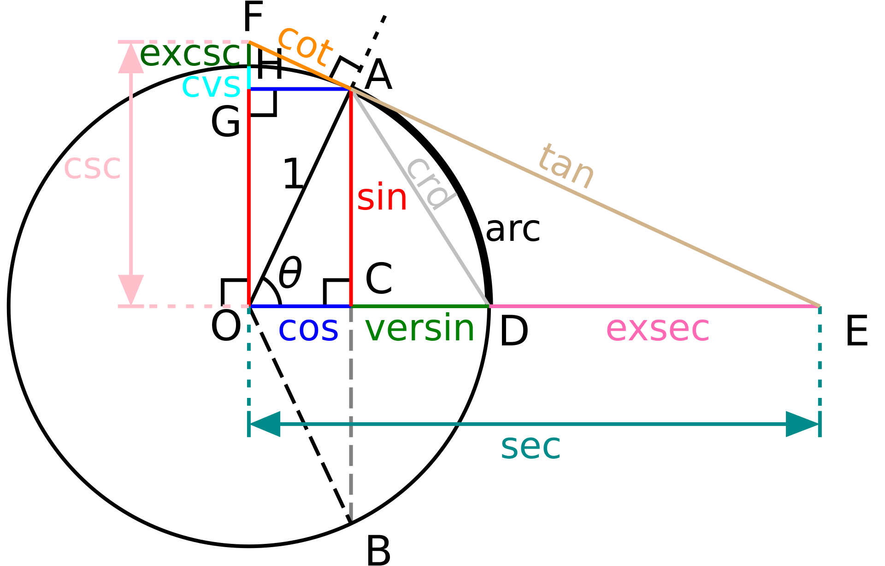
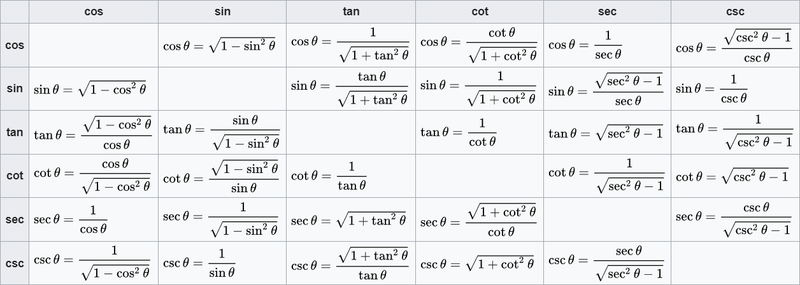

## Aires (formule)
- Carré : $A=c^2$  
  

- Rectangle : $A=L\times l$

- Triangle : $A=\frac{b\times h}{2}$

- Losange : $A=\frac{D \times d}{2}$

- Trapèze : $A=\frac{B+b}{2} \times h$
  

- Polygone régulier : $A=\frac{P}{2}\times a$

??? note annotate "l'apothème (1)"

    $a=\frac{c}{2\tan(\frac{180}{n})}$      

    n= nombre de côté

    On peut également exprimer la longueur "a" de l'apothème d'un poligone régulier de n côtés en fonction de la mesure du rayon du cercle circonscrit au polygone : $a={r\cos(\frac{180}{n})}$ 

1.  

- Cercle : $A=\pi r^2$
 
 
$P=2\pi r$

- Cône (aire latérale) : $A=\pi r \times g$

- Sphère : $A= 4\pi r^2$

##Volume et surface (formule)

la surface d'un solide est l'aire du patron de celui-ci

- Cube :  
$V=c^3$ 
  $S=6c^2$

- Parallélépipède :  
$V=L\times l \times h$  
$S=(2 \times L \times l)+(2 \times L \times h)+(2 \times l \times h)$

- prisme régulier :  
$V=Ab \times h$  
Ab = Aire de la base  

- cylindre : 
$V=\pi r^2 \times h$  
$S=2\pi r^2 + 2\pi r \times h$

- Cône (ou pyramide) :    le sommet des (pyramides/cônes) sont appellés "apex".  
   
$V= \frac{1}{3} Ab \times h$  
 
Ab = aire de la base

??? info "Pourquoi c'est $\frac{1}{3} Ab \times h$"

    Volume du cône  

     
     
    $\triangle ABM ~ \triangle AON$ (triangles similaires) 
     
    **Si on dit que x = AB, h = AO, k = BM et r = ON :**  
     
    $\frac{x}{h}=\frac{k}{r}$  
      $k=\frac{rx}{h}$  
      **Le Volume du Cône = Somme des Volumes de toutes les plaques**  
      
    $$\begin{align}
    {\int dv} & = \int_{0}^{h} \pi k^2 dx \\[2ex]
    {v} & = \pi \int_{0}^{h} (\frac{rx}{h})^2 dx \\[2ex]
    {v} & = \pi \frac{r^2}{h^2} \int_{0}^{h} x^2 dx \\[2ex]    
    {v} & = \frac{\pi r^2}{h^2} \times \frac{1}{3} \left( h^3-0 \right) \\[2ex]
    {v} & = \frac{1}{3} \pi r^2 h
    \end{align}$$

- sphère :  
$V=\frac{4}{3}\pi r^3$ 
 
??? info "Pourquoi c'est $\frac{4}{3}\pi r^3$"

     
     
    La méthode d'Archimède (redécouverte dans le palimpseste portant son nom) consiste à **découper la boule en disques minces**, donc des cylindres, dont on ajoute le volume (assimilé au produit de leur surface par leur épaisseur). En langage moderne, cela revient à **calculer la limite d'une somme de Riemann, et donc à calculer une intégrale définie. **Si l'on considère la variable h allant de **–R** à **R**, **le cylindre correspondant à la hauteur h et d'épaisseur infinitésimale dh a pour rayon rh vérifiant**, d'après le théorème de Pythagore rh2 + h2 = R2 ; comme le volume de ce cylindre est π rh2 dh, on obtient comme volume de la boule : 
     

  
    $$\begin{align}
    {V} & = \int_{-r}^{r} \pi(r^2-h^2) \mathrm{d}h \\[2ex]
    & = \left[ \pi(hr^2-\tfrac{1}{3}h^3) \right]_{-r}^{r} \\[2ex]
    & = \pi \left(r^3-\tfrac{1}{3}r^3 \right) - \pi \left(-r^3-\tfrac{1}{3}r^3 \right) \\[2ex]
    & = \tfrac{2}{3} \pi r^3 + \tfrac{2}{3} \pi r^3 \\[2ex]
    {V} & = \tfrac{4}{3} \pi r^3
    \end{align}$$

## fonctions et équations

**définition :**
  Une fonction est un procédé qui permet d'associer à un élément d'un ensemble de départ, un élément unique d'un ensemble d'arrivée. **Voici quelques exemples :** 
 

 

- $f(x)=0.5x+2$
 

- $f(x)=-x+5$
 
 
  
 

Il y a plusieurs fonction en maths : 
 
 
  - fonction exponentielle 
  - fonction logarithmique 
  - fonctions périodiques 
  - fonctions trigonométriques 
  etc... 

### _**Fontion affine**_

une fonction affine est une fonction obtenue par addition et multiplication de la variable par des constantes. Elle peut donc s'écrire sous la forme : 
 
$f(x)=ax+b$ 
 
a = le coefficient directeur 
b= l'ordonnée à l'origine
 

### _**fonction linéaire**_

Une fonction linéaire est une fonction qui à tout nombre x associe le nombre ax, où a est un nombre fixé. On note : 
 
$f(x)=ax$ 
 

### _**fonctions trigonométriques**_

les fonctions trigonométriques permettent de relier les longueurs des côtés d'un triangle en fonction de la mesure des angles aux sommets. Plus généralement, ces fonctions sont importantes pour étudier les triangles et les polygones, les cercles (on les appelle alors fonctions circulaires) et modéliser des phénomènes périodiques. 
 

**Comme fonctions trigonométriques, il y a :** 
 
- **(cos)** = cosinus 
- **(sin)** = sinus 
- **(tan)** = tangente ( à ne pas se tromper à la **tangente** en géométrie ) 
- **(cot)** = cotangente 
- **(csc)** = cosécante 
- **(sec)** = sécante 
- et **d'autre**
??? question "Comment retenir ?"

    
    

    
 
??? tip "Toutes les valeurs des fonctions trigonométriques d'un angle θ peuvent être représentées géométriquement."

    

??? tip "tableau des propriétés des fonctions trigonométriques"

    

**Représentations graphiques :**

**Sin :** 

**Cos :**  

**Tan :** 

 
**Animation monctrant la relation entre le cercle unité et les fonctions sinus et cosinus.** 

  

**identités trigonométriques :**

$\cos ^2 \theta + \sin ^2 \theta = 1$ 
 
$\tan ^2 \theta + 1 = \frac{1}{\cos ^2 \theta }$ 
 
$\cot ^2 \theta + 1 = \frac{1}{\sin ^2 \theta }$ 
 

 

 
### _**fonction du second degré**_

Une fonction du second degré ou fonction quadratique est une fonction numérique définie par :  
$f(x) = ax^2+bx+c$  
où $a$, $b$ et $c$ sont des nombres réels qui ne dépendent pas de la variable $x$, avec $a \neq 0$

**Ex : **$f(x) = x^2 - x -2$  
 
 
on appelle **"discriminant"** la notion algébrique intervenant dans la résolution d’une équation du second degré, plus connue sous le nom de delta (Δ).
Le discriminant de f est le nombre réel Δ défini par :   
$\Delta = b^2 - 4 ⁢ac$ .  
??? attention "représentation graphique"

    

 **$\Delta > 0$**     Si le discriminant est strictement **positif**, l'équation admet **deux solutions** conjuguées $x_1$ et $x_2$, qui s'écrivent :

$x_1, x_2 = \frac{-b\pm \sqrt{\Delta}}{2a} \in \Bbb R$

 **$\Delta = 0$**     Si le discriminant est **égal à 0**, l'équation admet **une solution** $x_1$ qui s'écrit :

$x_1 = \frac{-b}{2a} \in \Bbb R$

 **$\Delta < 0$**     Si le discriminant est strictement **négatif**, l'équation admet **deux solutions** conjuguées $x_1$ et $x_2$, qui s'écrivent :

$x_1, x_2 = \frac{-b\pm i \sqrt{|\Delta|}}{2a} \in \Bbb C$
 

 
### _**Fonction cubique **_

Une fonction cubique est une fonction de la forme :

$f(x) = ax^3 + bx^2 + cx + d$  
avec $a \neq 0$ 
 
La formule quadratique avec discriminant réduit :

On considère ici une fonction cubique $f$ définie par $f(x) = ax^3 + bx^2 + cx + d$ dont les coefficients, ainsi que la variable $x$, sont réels.

Les points critiques de $f$ sont les abscisses des points du graphe où la pente de la tangente est nulle, c'est-à-dire les $x$ en lesquels la dérivée de $f$ s'annule :
  
${\displaystyle 3ax^{2}+2bx+c=0}$.  
Les solutions de cette équation sont données, en utilisant la formule quadratique avec discriminant réduit :
  
${\displaystyle x_{\text{critique}}={\frac {-b\pm {\sqrt {\Delta _{0}}}}{3a}}}$. 
avec 
${\displaystyle \Delta _{0}=b^{2}-3ac}$. 
 
Le signe de Δ0 détermine le nombre de points critiques et d'extrema locaux de $f$ : 
  
si **$\Delta > 0$** alors $f$ a un maximum local et un minimum local ;  
si **$\Delta = 0$**, alors le point d'inflexion est le seul point critique ;  
si **$\Delta < 0$**, alors $f$ n'a pas de point critique.  
 

## Calculs indiens

## Symboles mathématiques ( avec écriture LaTeX )

??? abstract "_**Ensembles de nombres**_"

    | Symbole      | Description                          | MathJax                          |
    | :---------- | :----------------------------------- | :----------------------------------- |
    | $\Bbb A$       | Nombre algébrique  | `\Bbb A`  |
    | $\Bbb C$      | Nombre complexe | `\Bbb C`  |
    | $\Bbb H$    | Quaternion | `\Bbb H`  |
    | $\Bbb N$    | Entier naturel | `\Bbb N`  |
    | $\Bbb O$    | Octonion | `\Bbb O`  |
    | $\Bbb Q$    | Nombre rationnel | `\Bbb Q`  |
    | $\Bbb R$    | Nombre réel | `\Bbb R`  |
    | $\Bbb S$    | Sédénion | `\Bbb S`  |
    | $\Bbb Z$    | Entier relatif | `\Bbb Z`  |

??? abstract "_**Intervalles**_"

    | Symbole      | Usage                          | MathJax                          |
    | :---------- | :----------------------------------- | :----------------------------------- |
    | [ ]       | [a,b]  |   |
    | ] [      |]a,b[ |   |
    | ( )    | (a,b) | `[ ]`  |
    |  [ [   | [a,b[ | `( )`  |
    |  [ )   | [a,b) |  |
    |  ] ]   | ]a,b] |  |
    |   ( ]  | (a,b] |   |

??? abstract "_**Constantes mathématiques**_"

    | Symbole      | Description                          | MathJax                          |
    | :---------- | :----------------------------------- | :----------------------------------- |
    | $\pi$       | pi  | `\pi`  |
    | $\mathrm{e}$      | e | `\mathrm{e}`  |
    | $\phi$    | nombre d'or | `\phi`  |
    | $\varPhi$    | nombre d'or | `\varPhi`  |
    | $\mathrm{i}$    | Unité imaginaire | `\mathrm{i}`  |
    | $\gamma$    | constante d'Euler | `\gamma`  |
    | $\epsilon$    | Permittivité du vide | `\epsilon`  |
    | $\varepsilon$    | Nombre dual | `\varepsilon`  |
    | $\theta$    | Constante de Mills | `\theta`  |
    | $\vartheta$    | Constante de Mills | `\vartheta`  |
    | $\sigma$    | Constante de récurrence quadratique de Somos | `\sigma`  |
    | $\varsigma$    | Constante de récurrence quadratique de Somos | `\varsigma`  |
    | $\kappa$    | Constante gravitationnelle d'Einstein | `\kappa`  |
    | $\lambda$    | Constante de Prouhet-Thue-Morse | `\lambda`  |
    | $\mu$    | Constante de Ramanujan-Soldner | `\mu`  |
    | $\tau$    | Constante de Prouhet-Thue-Morse | `\tau`  |

??? abstract "_**Nombres complexes**_"

    | Symbole      | Usage                          | Description                          | MathJax                          |
    | :---------- | :----------------------------------- | :----------------------------------- | :----------------------------------- |
    | $\Im$       | $\Im (2+i) = 1$ | nombre complexe  | `\Im`  |
    | $\operatorname{Im}$      | $\operatorname{Im} (2+i) = 1$  | nombre complexe | `\operatorname{Im}`  |
    | $\Re$    | $\Re (2+i) = 1$  | nombre complexe | `\Re`  |
    | $\operatorname{Re}$    | $\operatorname{Re} (2+i) = 1$  | nombre complexe | `\operatorname{Re}`  |
    | $\bar{}$    | $\bar{z}$  | Conjugué | `\bar{}`  |
    | $\bar{\bar{}}$    | $\bar{\bar{z}}$  | Conjugué | `\bar{\bar{}}`  |
    | $\overline{}$    | $\overline{z}$  | Conjugué | `\overline{}`  |
    | $\overline{\overline{}}$    | $\overline{\overline{z}}$  | Conjugué | `\overline{\overline{}}`  |
    | ${}^\ast$    | ${z}^\ast$  | Conjugué | `{}^\ast`  |
    | $\vert      \vert$    | $\vert z \vert$  | Valeur absolue | `\vert`  |
    | $\arg$    | $\arg (z)$  | Coordonnées polaires | `\arg`  |

??? abstract "_**Opérations arithmétiques élémentaires**_"

    | Symbole      | Usage                          | Description                          | MathJax                          |
    | :---------- | :----------------------------------- | :----------------------------------- | :----------------------------------- |
    | $+$       | $a+b$ | Addition  | `+`  |
    | $-$      | $a-b$  | Soustraction | `-`  |
    | $\cdot$    | $a \cdot b$  | Multiplication | `\cdot`  |
    | $\times$    | $a \times b$  | Multiplication | `\times`  |
    | $\colon$    | $a \colon b$  | Division | `\colon`  |
    | $/$    | $a / b$  | Division | `/`  |
    | $\frac{}{}$    | $\frac{a}{b}$  | Division | `\frac{}{}`  |
    | $\tfrac{}{}$    | $\tfrac{a}{b}$  | Division (**t**extstyle) | `\tfrac{}{}`  |
    | $\dfrac{}{}$    | $\dfrac{a}{b}$  | Division (**d**isplaystyle) | `\dfrac{}{}`  |
    | $\cfrac{}{}$    | $a+\cfrac{1}{a+\cfrac{1}{a+\cdots\vphantom{\cfrac{1}{1}}}}$  | Division (Fraction continue) | `\cfrac{}{}`  |
    | $^{-1}$    | $a^{-1}$  | Inverse | `^{-1}`  |
    | $-$    | $-a$  | Opposé | `-`  |
    | $\pm$    | $\pm a$  | Signe plus ou moins | `\pm`  |
    | $\mp$    | $\mp a$  | Signe plus ou moins | `\mp`  |

