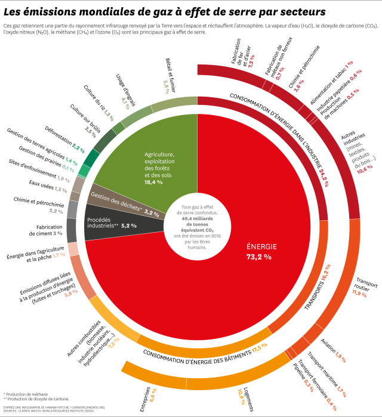

# Chapitre 1 : Autour de l'énergie électrique

## Ⅰ- D'où viennent les effets de serre ?

^^Bilan mission 1^^ :

Le secteur de l'énergie est les plus gros producteur de GES (1) .
{ .annotate }

1.  

La consommation énergetique mondiale a énormément augmenté en 50 ans du fait des activités humaines.

Cette énergie électrique provient essentiellement des centrales thermiques à combustion qui utilisent des combustibles fossiles ou bien de la biomasse (1) .
{ .annotate }

1.  Dans les centrales thermiques à combustion, des combustions sont nécessaires pour chaffer l'eau. Les combustibles sont généralement ==des sources d'énergie fossiles== (charbon, gaz naturel ou foul), ou bien de la biomasse et des déchets.

Or ces combustibles ont une forte empreinte carbone. Pour 1KWh d'électricité, le charbon a une empreinte carbone de 820g, contre 11g pour l'éolien. (1) 
{ .annotate }

1. 

